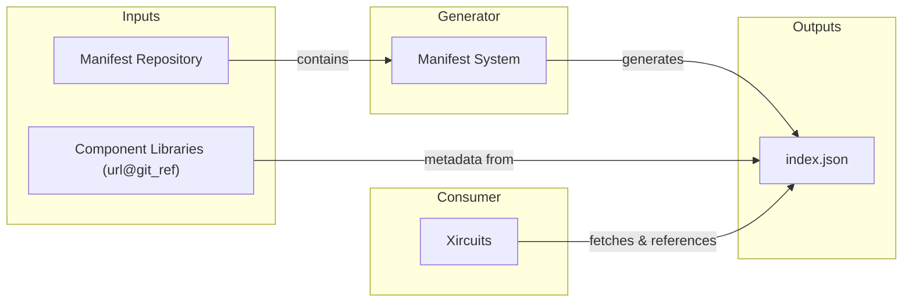

# Migrate Component Library Collection to Manifest Repository

## Status
Accepted

Proposed by: Mansour (10/07/2025)
Updated by: Fahreza (25/08/2025)
Discussed with: Eduardo Gonzalez, Paul Dubs

## Context

Following the implementation of component libraries as submodules in [ADR-0003](./0003-Refactor%20Component%20Libraries%20as%20Submodules.md), we identified several limitations with the Git submodule approach:

1. **Maintenance Overhead**: Adding or updating component libraries required commits to the main Xircuits repository, creating unnecessary version coupling between the core system and individual libraries.
2. **Scalability Issues**: As the number of component libraries grew, managing submodules became increasingly complex and cumbersome.
3. **Release Coupling**: Updates to component libraries necessitated full Xircuits releases, slowing down the ecosystem's evolution and preventing independent library development cycles.
4. **Configuration Dependency**: The system relied on parsing `.gitmodules` for component library discovery, tightly coupling component management to Git submodule infrastructure.

The Git submodule approach, while functional, created tight coupling between the core Xircuits system and individual component libraries, hindering independent development and deployment.

## Decision

We are migrating from Git submodules to a **manifest-based repository management system**. Instead of parsing `.gitmodules`, Xircuits now fetches and directly references a remote `index.json` file that contains all necessary component library metadata.

By default it points to https://github.com/XpressAI/xai-components-manifest/blob/main/index.json.

### Key Changes

1. **Remote Index Configuration**: Xircuits reads from a configurable manifest repository URL, which can be modified in the .xircuits/config.ini file:
   ```ini
   [DEV]
   BASE_PATH = xai_components
   INDEX_URL = https://github.com/XpressAI/xai-components-manifest/blob/main/index.json
   ```

2. **Direct Index Reference**: At startup, Xircuits fetches `index.json` from `INDEX_URL` and uses it directly for all component library operations. The index contains all needed metadata including:
   - Core identifiers: `library_id`, `name`, `path`, `url`, `git_ref`
   - Version information: `version`, `status`
   - Documentation: `description`, `readme`, `repository`
   - Dependencies: `requirements`, `keywords`

3. **Dynamic Component Management**: Based on the `index.json` data, Xircuits dynamically clones and installs component libraries as needed, eliminating the need for Git submodules.

### Workflow



**Before (Submodules):**
```
.gitmodules → Parse → Component Discovery & Installation
```

**After (Manifest):**
```
Remote index.json → Direct Reference → Component Discovery & Installation
```

## Consequences

### Advantages

1. **Decoupled Development**: Component libraries can be developed, updated, and released independently of Xircuits core releases.
2. **Simplified Management**: Adding new component libraries no longer requires commits to the main Xircuits repository.
3. **Eliminates Git Submodule Constraints**: No longer dependent on `.gitmodules` or Git submodule infrastructure.
4. **Direct Data Access**: Xircuits directly references the index without intermediate configuration file generation.
5. **Improved Scalability**: The system can handle an unlimited number of component libraries without impacting the core repository size.
6. **Flexible Configuration**: The manifest repository URL is configurable, allowing for custom or private component library collections.
7. **Rich Metadata**: Enhanced component library information enables better discovery and documentation.

### Disadvantages

1. **Network Dependency**: Initial setup and component discovery require network access to fetch the manifest repository and `index.json`.
2. **External Dependency**: Xircuits now depends on the availability of the remote manifest repository.
3. **Migration Effort**: Existing installations using submodules require migration to the new system.

### Migration Impact

- Git submodules and `.gitmodules` parsing are completely replaced with remote `index.json` fetching
- Component library discovery and installation directly reference the fetched index data
- Component libraries are dynamically cloned based on manifest data rather than being tracked as submodules
- The system maintains backward compatibility with existing component library structures
- Users benefit from automatic discovery of new component libraries without requiring Xircuits updates

This architectural change decouples component library management from the core Xircuits repository under the hood while maintaining the same user experience for component discovery and installation.