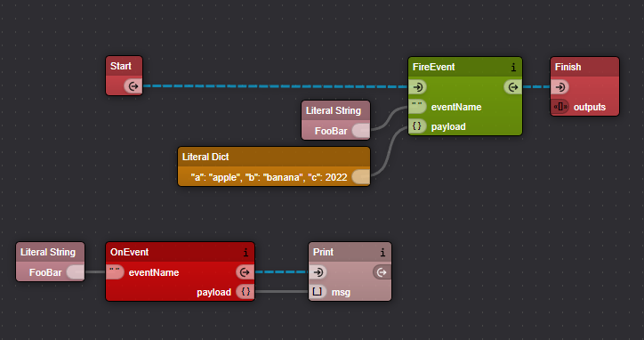

# Xircuits Event Component Library

Xircuits component library to allow usage of events in Xircuits diagrams.

## Example

## Installation

The `events` component library has no requirements and runs out of the box. It is also included in the base xircuits installation.

## Component Overview

- **`OnEvent`**: Defines an event listener that will be executed every time a particular event is fired.

- **`FireEvent`**: Triggers the execution of all event listeners that listen to a particular event.