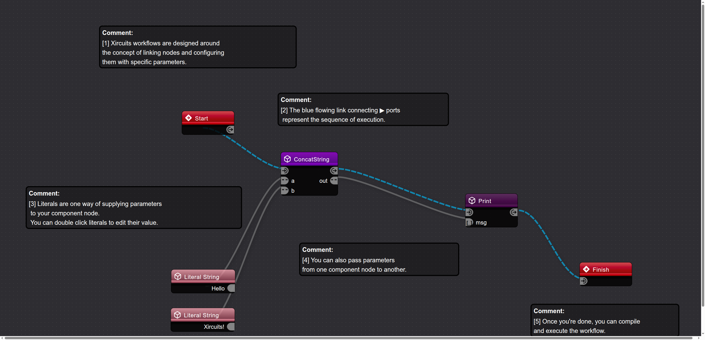

# xircuits-graph-viewer

Pure SVG renderer for `.xircuits` workflow files. Parses the JSON format and produces self-contained SVG that visually matches the Xircuits editor.



## Packages

| Package | npm | Purpose |
|---------|-----|---------|
| `xircuits-graph-core` | [](https://www.npmjs.com/package/xircuits-graph-core) | Parser + SVG renderer. Zero runtime deps. |
| `xircuits-graph-react` | [](https://www.npmjs.com/package/xircuits-graph-react) | React components (interactive + SSR-safe). |

## Quick Start

### React

```bash
npm install xircuits-graph-core xircuits-graph-react
```

**Point it at a `.xircuits` file** — that's it:

```tsx
import { XircuitsGraph } from 'xircuits-graph-react';

// src accepts any URL: uploaded file path, API endpoint, static asset, etc.
<XircuitsGraph src="/workflows/MyWorkflow.xircuits" />
```

With options:

```tsx
<XircuitsGraph
  src="/workflows/MyWorkflow.xircuits"
  theme="dark"
  height={500}
  interactive        // pan/zoom enabled (default: true)
  onNodeClick={(node) => console.log(node.name)}
/>
```

**Static rendering** (SSR-safe, no client JS needed):

```tsx
import { XircuitsGraphStatic } from 'xircuits-graph-react';

<XircuitsGraphStatic src="/workflows/MyWorkflow.xircuits" theme="dark" />
```

You can also pass pre-loaded JSON via `data` instead of `src`:

```tsx
import workflow from './MyWorkflow.xircuits';

<XircuitsGraph data={workflow} />
```

### Core (framework-agnostic)

Works with Svelte, Vue, plain HTML, Node.js — anything.

```bash
npm install xircuits-graph-core
```

**From a URL** (browser):

```js
import { renderFromUrl } from 'xircuits-graph-core';

const svg = await renderFromUrl('/workflows/MyWorkflow.xircuits', { theme: 'dark' });
document.getElementById('viewer').innerHTML = svg;
```

**From JSON data**:

```js
import { renderXircuits } from 'xircuits-graph-core';

const svg = renderXircuits(workflowJson, { theme: 'dark' });
```

**With pan/zoom**:

```js
import { parse, renderToElement } from 'xircuits-graph-core';
import { attachPanZoom } from 'xircuits-graph-core/interaction';

const res = await fetch('/workflows/MyWorkflow.xircuits');
const svg = renderToElement(parse(await res.json()), { theme: 'dark' });
document.body.appendChild(svg);
const { destroy } = attachPanZoom(svg);
```

### Docusaurus

```mdx
import { XircuitsGraphStatic } from 'xircuits-graph-react';

# My Workflow

<XircuitsGraphStatic src="/assets/MyWorkflow.xircuits" height={400} />
```

For interactive mode, wrap with `BrowserOnly`:

```mdx
import BrowserOnly from '@docusaurus/BrowserOnly';

<BrowserOnly>
  {() => {
    const { XircuitsGraph } = require('xircuits-graph-react');
    return <XircuitsGraph src="/assets/MyWorkflow.xircuits" interactive />;
  }}
</BrowserOnly>
```

## API

### Core

| Function | Description |
|----------|-------------|
| `renderFromUrl(url, options?)` | Fetch a `.xircuits` URL and return SVG string. Browser only. |
| `renderXircuits(json, options?)` | One-shot: parse JSON + render to SVG string. |
| `parse(json)` | Parse `.xircuits` JSON into `XGraph`. |
| `renderToString(graph, options?)` | Render `XGraph` to SVG string. Works in Node.js and browsers. |
| `renderToElement(graph, options?)` | Render `XGraph` to DOM `SVGSVGElement`. Browser only. |
| `validate(json)` | Validate a `.xircuits` file without parsing. |
| `attachPanZoom(svg, options?)` | Add mouse/touch pan and zoom to rendered SVG. |

### React

| Component | Props | Description |
|-----------|-------|-------------|
| `<XircuitsGraph>` | `src` or `data`, `theme`, `interactive`, `height`, ... | Interactive viewer with pan/zoom. |
| `<XircuitsGraphStatic>` | `src` or `data`, `theme`, `height`, ... | Static SVG output, SSR-safe. |

### `RenderOptions`

```ts
{
  theme?: 'dark' | 'light';      // default: 'dark'
  width?: number;                  // SVG width
  height?: number;                 // SVG height
  padding?: number;                // viewport padding (default: 40)
  fitView?: boolean;               // auto-fit viewBox (default: true)
  className?: string;              // root SVG class
  nodeClassFn?: (node) => string;  // custom per-node CSS classes
  edgeClassFn?: (edge) => string;  // custom per-edge CSS classes
}
```

## Development

```bash
pnpm install

# Build core
cd packages/core && pnpm build

# Run tests (24 tests)
cd ../..
node_modules/.bin/vitest run

# Generate a PNG preview (requires Google Chrome)
google-chrome --headless=new --no-sandbox \
  --screenshot=output.png --window-size=2700,1400 \
  /tmp/rendered.html
```

### Project Structure

```
xircuits-graph-viewer/
├── packages/
│   ├── core/src/               # xircuits-graph-core (zero runtime deps)
│   │   ├── types.ts            # XGraph, XNode, XEdge, XPort
│   │   ├── parser/             # .xircuits JSON → XGraph
│   │   ├── layout/             # Node metrics, viewBox computation
│   │   ├── render/             # SVG generation (nodes, ports, edges, defs)
│   │   ├── svg/                # Builder utilities, bezier curves
│   │   └── interaction/        # Pan/zoom (browser-only)
│   └── react/src/              # xircuits-graph-react
│       ├── XircuitsGraph.tsx       # Interactive (client-side)
│       └── XircuitsGraphStatic.tsx # SSR-safe (string output)
├── demo/                       # Vite + React demo app
├── __tests__/                  # Parser + render tests
└── vitest.config.ts
```

## Publishing to npm

```bash
# Build both packages
cd packages/core && pnpm build
cd ../react && pnpm build

# Update workspace:* → actual version in react/package.json
# "xircuits-graph-core": "workspace:*"  →  "xircuits-graph-core": "^0.1.0"

# Publish (core first, react depends on it)
cd ../core && npm publish --access public
cd ../react && npm publish --access public
```

## License

MIT
